# spring-instagram-20th
CEOS 20th BE study - instagram clone coding

# 1주차


## ERD

### 전체 구조

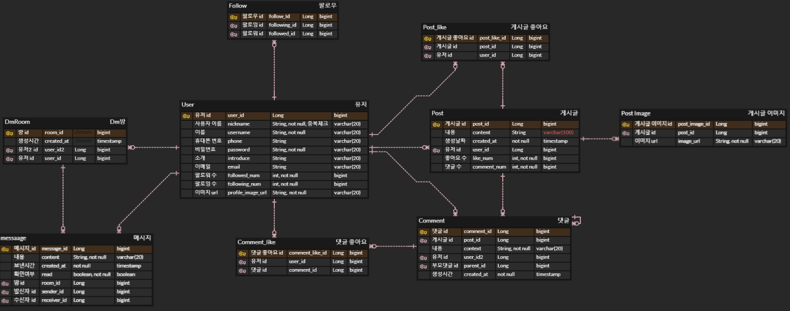

### 세부 구조

#### 1. 유저 간 1:1 DM 기능

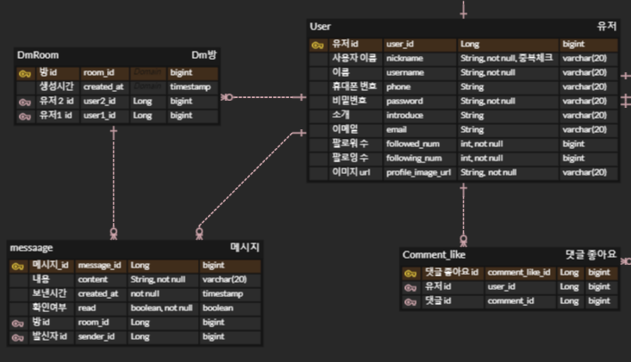

   - 처음에는 한 명의 유저는 여러 dm방을 가질 수 있고, 하나의 dm방은 여러 유저와 관계를 맺을 수 있기에 다대다 관계이므로 1:N, N:1 관계로 풀어주기 위해 중간테이블을 두려고 했다. 하지만 이 방식에서는 Message 테이블이 User와 Room을 직접 참조하지 못하고 중간테이블을 거쳐야 해 구조가 복잡해져 다시 생각해보았다. 1:1 채팅이기에 하나의 채팅방은 두명의 유저와만 관계를 맺기 때문에 굳이 다대다 관계로 볼 필요가 없이, DmRoom 엔티티에 유저1 id와 유저2 id를 외래키로 두어 각 유저와 Dm방이 관계를 맺도록 함으로써 DM방과 User를 N:1관계로 보았다. 대신 이 관계를 두 유저와 가지므로 두 번 가지게 된다.

   - 각 메시지마다 담아야 하는 정보가 많기 때문에 메시지를 채팅방 엔티티에 포함시키지 않고 Message 엔티티로 따로 분리하고 User와 DmRoom 엔티티와 관계를 맺도록 했다.


#### 2. 게시글 기능

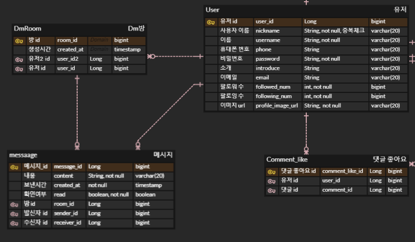

   - 게시글 이미지 : 사진을 포함한 게시글을 작성할 수 있도록 이미지 엔티티를 생성하였으며, 게시글 ID를 외래 키로 설정하여 각 게시글에 사진을 첨부할 수 있도록 구성하였다. 서버에 이미지를 업로드한 후 해당 이미지의 URL을 데이터베이스에 저장하도록 하였다.
   
   - 좋아요 수 : 누가 좋아요 눌렀는지 조회할 일은 적지만 수는 대부분 게시글과 함께 표시되므로 Post 엔티티에 좋아요 수를 저장한다.

   - 게시글 좋아요 : 한 명의 유저는 여러 게시글에 좋아요를 누를 수 있고, 한 게시글은 여러 유저로부터 좋아요를 받을 수 있어 다대다 관계다. 따라서 중간테이블인 게시글 좋아요 테이블을 두고 유저 id와 게시글 id을 외래키로 가져 관계를 맺도록 했다.


#### 3. 댓글 기능

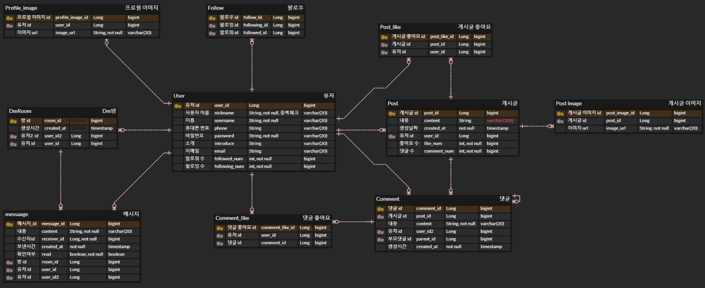

   - 대댓글 : 댓글과 대댓글은 1:N 관계이고, 둘의 필드 구성이 매우 유사해 엔티티를 분리하지 않고, Comment 엔티티를 순환참조 하도록 구성했다. 대댓글을 구현하기위해 Comment 엔티티에 부모댓글의 id인 parent_id를 외래키로 설정하고 이를 참조하도록 했다. 해당 댓글이 부모댓글이라면 parent_id는 null이므로 parent_id 필드는 null 값을 허용해준다.

   - 댓글 좋아요 : 댓글 좋아요 엔티티를 두고 유저 id와 게시글 id을 외래키로 가져 관계를 맺도록 했다.

#### 4. 유저 기능

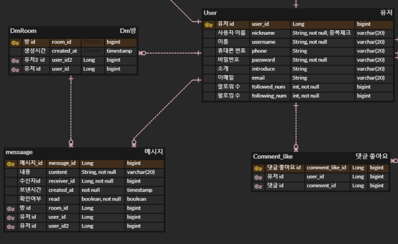

   - 회원가입 : 휴대폰 번호 or 이메일, 성명, 사용자 이름(닉네임), 비밀번호를 입력해 회원가입 한다. 이때 사용자 이름은 중복되지 않는지 검사해주어야 한다.
   
   - 로그인 : 휴대폰 번호 or 이메일 or 사용자 이름과 비밀번호를 입력해 로그인한다.

   - 프로필 이미지 : 사용자는 하나의 프로필 사진만 설정할 수 있고, 별도로 관리할 이미지 속성이 없기 때문에 이미지 엔티티를 따로 생성하지 않고, User 엔티티에 이미지 URL을 저장하도록 했다.

   - 팔로우 기능 : 유저 간에는 팔로잉과 팔로워 관계가 존재한다. 한 유저는 여러 유저를 팔로우 할 수 있고, 한 유저는 여러 유저로부터 팔로우를 받을 수 있다. 따라서 Follow 테이블에 팔로우하는 유저의 ID와 팔로우받는 유저의 ID를 각각 외래 키로 저장하였다.
   

## 엔티티 생성
Test에 쓰일 Post 엔티티는 다음과 같다.
```
@Entity
@Getter
@NoArgsConstructor(access = AccessLevel.PROTECTED)
@Builder
@AllArgsConstructor // Builder는 파라미터 있는 생성자가 필요
public class Post {
    @Id
    @GeneratedValue(strategy = GenerationType.IDENTITY)
    @Column(name="post_id")
    private Long id;

    private String content;
    private int like_num;

    @CreationTimestamp
    @Column(updatable=false)
    private LocalDateTime created_at;

    @ManyToOne(fetch = FetchType.LAZY)
    @JoinColumn(name="user_id")
    private User user;

    @OneToMany(mappedBy="post")
    private List<PostImage> images;

}

```

Post를 조회할때 images와 댓글을 함께 조회 할 일이 많을 것 같아 양방향 매핑해주었다. 좋아요 리스트는 조회할 일이 많지 않고 수만 자주 조회되므로 좋아요 수를 post필드에 추가하였다.

cf) JPA의 Entity는 기본 생성자(NoArgsConstructor)가 반드시 필요하다!

-> 이유 : JPA는 데이터베이스에서 조회한 값을 엔티티 객체로 변환할 때 **Reflection**을 사용하여 객체를 생성한다. 이 과정에서 기본 생성자를 호출해 빈 객체를 먼저 만든 후, 조회한 데이터를 각 필드에 매핑한다. 따라서 기본 생성자가 없다면  JPA는 객체를 생성할 수 없고, 결국 데이터베이스에서 조회한 값을 엔티티로 변환하는 작업이 실패하게 된다.
Reflection이란? : 리플렉션은 자바에서 제공하는 기능으로, 구체적인 Class Type을 알지 못해도 런타임에 해당 클래스의 이름, 변수, 메소드에 접근할 수 있게 해준다.


## Repository 단위 테스트
Repository 단위테스트에는 @JpaDataTest를 많이 사용한다고 한다.

#### 1) Post Repository에서 user_id로 Post를 찾아 조회하는 단위테스트.

```
@DataJpaTest
@AutoConfigureTestDatabase(replace = AutoConfigureTestDatabase.Replace.NONE)
@Import({PostRepository.class,UserRepository.class})
class PostRepositoryTest {

    @Autowired
    private PostRepository postRepository;

    @Autowired
    private UserRepository userRepository;

    private Post post1;
    private Post post2;
    private Post post3;
    private User user;

    @BeforeEach // 테스트 실행 전에 실행
    void setUp(){
        user=User.builder()
                .nickname("sh")
                .username("test1")
                .phone("010-1111-1111")
                .email("11@naver.com")
                .password("111")
                .introduce("test")
                .followed_num(0)
                .following_num(1)
                .profile_image_url("https://example.com/default-profile.png")
                .isPublic(true)
                .build();

        post1=Post.builder()
                .content("testPost 1")
                .like_num(0)
                .user(user)
                .build();

        post2=Post.builder()
                .content("testPost 2")
                .like_num(1)
                .user(user)
                .build();

        post3=Post.builder()
                .content("testPost 3")
                .like_num(0)
                .user(user)
                .build();

        userRepository.save(user);
        postRepository.save(post1);
        postRepository.save(post2);
        postRepository.save(post3);
    }

    @Test
    @Transactional
    void 게시글_조회_테스트(){

        //given
        Long userId=user.getId();

        //when
        List<Post> posts=postRepository.findByUser_Id(userId);

        //then
        // 게시글 갯수 확인
        assertEquals(3, posts.size());
        // 게시글 내용 확인
        assertEquals("testPost 1", posts.get(0).getContent());
        assertEquals("testPost 2", posts.get(1).getContent());
        assertEquals("testPost 3", posts.get(2).getContent());

    }
}

```

- 과정 : @BeforeEach를 사용하여 테스트 전에 user,post 객체를 생성하여 repository에 저장하게끔 했다. 이후, user 객체에서 user_id를 가져와 이 user_id를 사용하여 해당 사용자의 post를 조회하는 테스트를 수행

cf) 처음에는 `@Import({PostRepository.class,UserRepository.class})` 를 빼고 테스트 진행했더니 `No qualifying bean of type 'com.ceos20.instagram.post.repository.PostRepository' available` 오류가 발생했다..

이는 내가 구현한 PostRepository가 JpaRepository를 상속한 인터페이스가 아니라 직접 구현된 클래스이기 때문이다. Spring은 JpaRepository를 상속하는 인터페이스를 자동으로 빈으로 등록하지만, 그렇지 않은 직접 구현한 리포지토리는 자동으로 빈을 생성하지 않으므로 이를 수동으로 등록해야한다. 따라서 **@Import(PostRepository.class)** 를 통해 해당 리포지토리를 테스트에 수동으로 주입해야 한다.


테스트 성공 후 아래와 같은 쿼리가 출력된다.

1. @BeforeEach 를 통해 user와 post1,2,3 객체를 생성 후 테이블에 저장
```
Hibernate: 
    insert 
    into
        user
        (email, introduce, is_public, nickname, password, phone, profile_image_url, username) 
    values
        (?, ?, ?, ?, ?, ?, ?, ?)
Hibernate: 
    insert 
    into
        post
        (content, created_at, like_num, user_id) 
    values
        (?, ?, ?, ?)
Hibernate: 
    insert 
    into
        post
        (content, created_at, like_num, user_id) 
    values
        (?, ?, ?, ?)
Hibernate: 
    insert 
    into
        post
        (content, created_at, like_num, user_id) 
    values
        (?, ?, ?, ?)
```

2. findByUser_Id의 파라미터로 전달받은 user_id와 같은 user_id를 가진 post를 post 테이블에서 찾는다.

```
Hibernate: 
    select
        p1_0.post_id,
        p1_0.content,
        p1_0.created_at,
        p1_0.like_num,
        p1_0.user_id 
    from
        post p1_0 
    where
        p1_0.user_id=?
```

#### 2. Comment Repository post id를 통한 부모댓글 조회, 부모댓글 id를 통한 자식댓글 조회테스트
```
@DataJpaTest
@AutoConfigureTestDatabase(replace = AutoConfigureTestDatabase.Replace.NONE)
@Import({CommentRepository.class, UserRepository.class,PostRepository.class})
public class CommentRepositoryTest {
    @Autowired
    private PostRepository postRepository;

    @Autowired
    private UserRepository userRepository;

    @Autowired
    private CommentRepository commentRepository;

    private Post post1;
    private User user;
    private Comment parent;
    private Comment child1;
    private Comment child2;

    @BeforeEach
        // 테스트 실행 전에 실행
    void setUp(){
        user=User.builder()
                .nickname("sh")
                .username("test1")
                .phone("010-1111-1111")
                .email("11@naver.com")
                .password("111")
                .introduce("test")
                .profile_image_url("https://example.com/default-profile.png")
                .isPublic(true)
                .build();

        post1=Post.builder()
                .content("testPost 1")
                .like_num(0)
                .user(user)
                .build();

        parent=Comment.builder()
                .context("I'm parent")
                .post(post1)
                .user(user)
                .build();

        child1=Comment.builder()
                .context("I'm child1")
                .post(post1)
                .user(user)
                .parent(parent)
                .build();

        child2=Comment.builder()
                .context("I'm child2")
                .post(post1)
                .user(user)
                .parent(parent)
                .build();


        userRepository.save(user);
        postRepository.save(post1);
        commentRepository.save(parent);
        commentRepository.save(child1);
        commentRepository.save(child2);

    }

    @Test
    @Transactional
    void 댓글_조회_테스트(){

        //given
        Long postId=post1.getId();
        Long parentId=parent.getId();

        //when
        List<Comment> parents=commentRepository.findByPost_Id(postId);
        List<Comment> childs=commentRepository.findByParent_Id(parentId);

        //then
        // 게시글 갯수 확인
        assertEquals(1, parents.size());
        assertEquals(2, childs.size());

        // 게시글 내용 확인
        assertEquals("I'm parent", parents.get(0).getContext());
        assertEquals("I'm child1", childs.get(0).getContext());
        assertEquals("I'm child2", childs.get(1).getContext());

    }
}

```

쿼리 조회 결과

1. @BeforeEach 를 통해 user와 post1, parent, child1,2 객체를 생성 후 테이블에 저장
```
Hibernate: 
    insert 
    into
        user
        (email, introduce, is_public, nickname, password, phone, profile_image_url, username) 
    values
        (?, ?, ?, ?, ?, ?, ?, ?)
Hibernate: 
    insert 
    into
        post
        (content, created_at, like_num, user_id) 
    values
        (?, ?, ?, ?)
Hibernate: 
    insert 
    into
        comment
        (context, created_at, parent_id, post_id, user_id) 
    values
        (?, ?, ?, ?, ?)
Hibernate: 
    insert 
    into
        comment
        (context, created_at, parent_id, post_id, user_id) 
    values
        (?, ?, ?, ?, ?)
Hibernate: 
    insert 
    into
        comment
        (context, created_at, parent_id, post_id, user_id) 
    values
        (?, ?, ?, ?, ?)
```

2. findByPost_Id의 파라미터로 전달받은 post_id와 같은 post_id를 가진 부모댓글을 Comment 테이블에서 찾는다. findByParent_Id의 파라미터로 전달받은 parent_id와 같은 parent_id를 가진 자식 댓글을 Comment 테이블에서 찾는다.

```
Hibernate: 
    select
        c1_0.comment_id,
        c1_0.context,
        c1_0.created_at,
        c1_0.parent_id,
        c1_0.post_id,
        c1_0.user_id 
    from
        comment c1_0 
    where
        c1_0.post_id=? 
        and c1_0.parent_id is null
Hibernate: 
    select
        c1_0.comment_id,
        c1_0.context,
        c1_0.created_at,
        c1_0.parent_id,
        c1_0.post_id,
        c1_0.user_id 
    from
        comment c1_0 
    where
        c1_0.parent_id=?

```
## (옵션) JPA 관련 문제 해결

### Q1. 어떻게  data jpa는 interface만으로도 함수가 구현이 되는가?

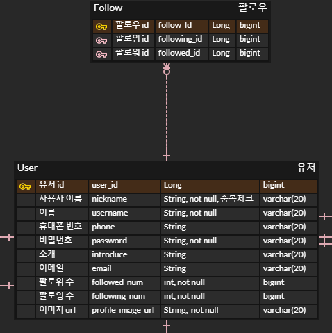

Spring Data JPA는 애플리케이션 실행 시, JpaRepository 인터페이스를 상속하는 repository 인터페이스에 대해 프록시 패턴을 사용해 SimpleJpaRepository 기반의 구현체를 동적으로 생성하고, 이를 빈으로 등록해 의존성을 주입해주기 때문이다.

**SimpleJpaRepository**

```
@Repository
@Transactional(readOnly = true)
public class SimpleJpaRepository<T, ID> implements JpaRepositoryImplementation<T, ID> {
	...
    
    @Transactional
	@Override
	public <S extends T> S save(S entity) {

		Assert.notNull(entity, "Entity must not be null.");

		if (entityInformation.isNew(entity)) {
			em.persist(entity);
			return entity;
		} else {
			return em.merge(entity);
		}
	}
    
    ...
}
```

-> @Repository 어노테이션이 붙어있고 save와 같은 메소드가 구현되어 있는 것을 확인할 수 있다. 이와 같이 EntityManager를 주입받아 JPA를 직접 사용하는 방식으로 구현되어 있다.


### Q2. Data jpa를 찾다보면 SimpleJpaRepository에서  entity manager를 생성자 주입을 통해서 주입 받는다. 근데 싱글톤 객체는 한번만 할당을  받는데, 한번 연결 때 마다 생성이 되는 entity manager를 생성자 주입을 통해서 받는 것은 수상하지 않는가? 어떻게 되는 것일까? 한번 알아보자 

우선 EntityManager에 대해 살펴보자. 모든 JPA의 동작은 Entity들을 기준으로 돌아가게 되는데, 이 때 Entity들을 관리하는 클래스가 Entity Manager다. Entity Manager는 여러 스레드가 동시에 접근하면 동시성 문제가 발생하므로 이를 하나로 공유하면 안되고, 매 트랜잭션마다 새로 만들어주어야 한다. 즉, EntityManager는 트랜잭션 시작 시 생성되고 트랜잭션이 종료되면 닫히기 때문에 매번 새로운 트랜잭션마다 새로운 Entity Manager 인스턴스가 생성된다.

이제 질문으로 돌아와서, 싱글톤 객체인 SimpleJpaRepository에서 매번 새로운 EntityManager를 주입받는 것이 가능한 이유에 대해 살펴보면 결국 프록시 패턴과 관련있다고 한다. Spring Data JPA에서 Entity Manager가 생성자 주입을 통해 주입될 때, 실제 EntityManager를 주입하는 것이 아니라 실제 EntityManager를 연결해주는 EntityManager 프록시 객체를 주입해준다.이 프록시는 현재 트랜잭션에 대한 참조를 통해 실제 EntityManager 인스턴스에 접근하기에, 트랜잭션이 다르더라도 프록시가 적절한 EntityManager를 제공하여 SimpleJpaRepository가 항상 적절한 EntityManager와 함께 작동할 수 있다.


### Q3. fetch join 할 때 distinct를 안하면 생길 수 있는 문제

fetch join이란? : jpa에서 일반 join을 사용해 엔티티를 가져올 경우, 그 엔티티와 연관된 다른 엔티티까지 한번에 함께 조회하여 가져오지 않는다.
`select m from Member m join m.team` 이렇게 join을 사용하여 Member를 조회할 때 소속된 팀도 같이 가지고 올 경우, "select m from Member m"으로 쿼리를 보내고 결괏값으로 받은 객체들에서 member.getTeam으로 팀을 가져오게 되어 전체 Member를 조회하는 쿼리 한 개, Member와 연관된 Team을 조회하는 쿼리가 최대 N개가 발생하여 쿼리가 최대 N+1개 날라가는 문제가 생긴다. (모든 멤버들이 각각 다른 팀에 속해있으면 팀의 갯수 N만큼 쿼리문이 날라감, 모든 멤버들이 동일한 팀에 속한 경우는 1번 날라감) 

이를 해결하기 위해 `select m from Member m join fetch m.team` 이렇게 한 번의 쿼리로 연관된 엔티티까지 한번에 함께 조회하는 `fetch join` 방법이 사용된다. 즉, 나와 관련된 것들을 다 긁어오게 되어 즉시로딩 같은 역할을 하게 된다.

근데 fetch join을 사용할 때 distinct를 안 하면 문제가 생길 수 있다. 일대다 fetch join의 경우, 부모 엔티티가 자식 엔티티의 수만큼 중복돼서 나타나는 문제가 있다.  
`select t from Team t join fetch t.member` 으로 Team(일)을 조회할 때 팀이 속한 Member(다)도 조회할 때, inner join에 의해 매칭되는 데이터를 반환하여 Team A에 속한 멤버가 3명이면 Team A가 세 번 조회되는 문제가 발생한다. 이를 막으려면 `select distinct t from Team t join fetch t.members` 이렇게 distinct 키워드를 붙여 각 팀마다 한 번씩만 조회되게 해야 한다. 이때 distinct는 SELECT 대상(Team)에 대해서 중복제거 한다.

#### 일대다를 패치 조인한다면 꼭 distinct 를 써야 한다 !


### Q4. fetch join 을 할 때 생기는 에러가 생기는 3가지 에러 메시지의 원인과 해결 방안

#### 1) `HHH000104: firstResult/maxResults specified with collection fetch; applying in memory!`

- 의미 : fetch join 과 pagination 을 같이 사용하면 페이징이 되지 않고, "모든 데이터"를 가져와 메모리에 올려두고 페이징을 처리한다는 뜻

- 원인 : 1:N 관계를 fetch join하게 되면, 주요 엔티티인 1의 데이터가 중복이 돼서 data row 수가 늘어나기 때문에 데이터베이스의 limit과 offset을 이용한 쿼리를 통해 pagination하는 것이 불가능하다고 한다. 이 문제를 해결하기 위해 fetch join을 + 페이징 기능을 사용하려고 하는 경우, Hibernate에서는 자체적으로 모든 데이터를 불러와 주요 엔티티의 중복 row를 없앤 후 offset과 limit을 적용하여 어플리케이션으로 보내주는데 이 작업이 메모리에서 일어나게 돼서 위험하다.

- 해결법 : application.yml에 default_batch_fetch_size 설정하기. (처음부터 member를 fetch join해서 가져오는 대신 지연로딩을 유지하고, hibernate의 default_batch_fetch_size옵션을 사용하여
 부모(1, Team) 엔티티의 key가 default_batch_fetch_size 개수만큼 쌓일 때까지 기다린 후, in절에 부모 key를 넘겨주어 한 번의 쿼리로 연관(자식, Member) 엔티티를 조회하도록 한다. **select member where teamId in (1,2,3,...,n)으로 조회**)


#### 2) `query specified join fetching, but the owner of the fetched association was not present in the select list`

- 원인 : fetch join은 "엔티티티 상태에서" 엔티티 그래프를 참조하기 위해 사용하는거라서, 엔티티가 아닌 dto를 조회하는데 (select DTO from ~) fetch join 을 쓰면 문제가 발생한다.

- 해결법 : fetch join을 제거하고 그냥 join 사용하기


#### 3) `org.hibernate.loader.MultipleBagFetchException: cannot simultaneously fetch multiple bags`

- 의미 : bag 컬렉션이란? 순서가 없고 키가 없으며, 중복을 허용한다. Java 컬렉션에는 Bag가 구현되어 있지 않아 List를 사용한다.

- 원인 : 1:N 관계에서 쿼리가 동시에 2개 이상의 연관테이블에 fetch join을 사용할 때 발생 (`select t from Team t join fetch t.members join fetch t.rules`)

- 해결법 : application.yml에 default_batch_fetch_size 설정하기

```
spring:
  jpa:
    properties:
      hibernate.default_batch_fetch_size: 10
```


#### 정리 : 지연로딩을 사용하더라도 N+1 문제를 겪어 이를 해결하기 위해 fetch join을 사용하는데, xxToOne에서 fetch join 사용이 자유롭지만 `xxToMany에서는 오류` 뜨는 경우가 있으니 잘 사용하기


# 2주차

### 지난주차 코드 리팩토링

#### Base Entity 사용

created_at과 updated_at 속성은 여러 엔티티에서 공통적으로 사용되므로, 이를 BaseTimeEntity로 분리하고, 해당 속성이 필요한 엔티티들은 BaseTimeEntity를 상속받아 사용하도록 구현하였다.

1) BaseTimeEntity

```
@Getter
@MappedSuperclass
@EntityListeners(AuditingEntityListener.class) // 엔티티의 수정/생성등의 이벤트가 발생하였을 때, 이와 같은 변경사항을 Audit하기 위함
public class BaseTimeEntity {
    @CreatedDate
    @Column(name="created_at", updatable = false, columnDefinition = "timestamp")
    private LocalDateTime createdAt;

    @LastModifiedDate
    @Column(name="updated_at", columnDefinition = "timestamp")
    private LocalDateTime updatedAt;
}
```

- @MappedSuperclass : BaseEntity를 상속한 엔티티들이 BaseEntity의 필드들을 칼럼으로 인식하게 된다.
- @EntityListeners(AuditingEntityListener.class) : 특정 엔티티 클래스에 적용되어, 해당 엔티티에서 발생하는 엔티티의 수정/생성 등의 이벤트를 감지하고 처리, 기록하는데 사용
- @CreatedDate : Entity가 생성되어 저장될 때 날짜와 시간이 db에 자동으로 저장된다.
- @LastModifiedDate : Entity의 값을 변경할 때 날짜와 시간이 db에 자동으로 저장된다.


2) BaseTimeEntity를 상속

```

@Entity
@Getter
@NoArgsConstructor(access = AccessLevel.PROTECTED)
@Builder
@AllArgsConstructor
public class Comment extends BaseTimeEntity {
    @Id
    @GeneratedValue(strategy = GenerationType.IDENTITY)
    @Column(name="comment_id")
    private Long id;

    @NotNull
    @Column(columnDefinition = "text")
    private String content;

    @ManyToOne(fetch=FetchType.LAZY)
    @JoinColumn(name="post_id")
    private Post post;

    @ManyToOne(fetch=FetchType.LAZY)
    @JoinColumn(name="user_id")
    private User user;

    @ManyToOne(fetch=FetchType.LAZY)
    @JoinColumn(name="parent_id")
    private Comment parent;

    @OneToMany(mappedBy="parent")
    private List<Comment> children = new ArrayList<>();

}
```

3) 어플리케이션의 main method가 있는 클래스에 @EnableJpaAuditing 적용하기

```
@SpringBootApplication
@EnableJpaAuditing
public class InstagramApplication {

	public static void main(String[] args) {
		SpringApplication.run(InstagramApplication.class, args);
	}

}

```

- @EnableJpaAuditing : 어플리케이션의 main method가 있는 클래스에 적용하며 JPA Auditing(감시) 기능을 어플리케이션 전역적으로 활성화하기 위한 어노테이션이다. 


### 구현할 기능

- 게시글 조회
- 게시글에 사진과 함께 글 작성하기
- 게시글에 댓글 및 대댓글 기능
- 게시글에 좋아요 기능
- 게시글, 댓글, 좋아요 삭제 기능
- 유저 간 1:1 DM 기능
- 팔로우 기능
- 댓글 작성하기, 대댓글 작성하기
- 댓글 좋아요
- 프로필 이미지 등록하기


### cascade=CascadeType.ALL 속성

```
@Transactional
    public void createPost(PostRequestDto postRequestDto,Long userId){

        //User 객체 가져오기
        User user=userRepository.findById(userId).orElseThrow(()-> new IllegalArgumentException("해당 id의 유저가 존재하지 않습니다."));
        
        //post 엔티티 생성, 저장
        Post newPost=postRequestDto.toPost(user);
        //postRepository.save(newPost);  (불필요)
        
        //MultipartFile을 PostImage로 변환
        List<PostImage> images=postImageService.changeToPostImage(postRequestDto.getImages(), newPost);
        
        //PostImage를 db에 저장
        //postImageService.saveImages(images);  (불필요)
        
        //Post와 image 매핑
        newPost.mapImages(images);

        postRepository.save(newPost);
    }
```
- Q. postRepository.save(newPost)를 아직 하지 않은 상태에서도 PostImage와의 연관관계 설정이 가능하고 db에 저장될 때 post의 id가 외래키로 잘 들어가는 이유
 
  A. Post가 PostImage를 참조하고 있고(@OneToMany) 이때 cascade = CascadeType.ALL 속성을걸어줘서!

- Q. postImageService.saveImages(images)로 이미지를 직접 저장하지 않아도 postRepository.save(newPost)로 함께 저장되는 이유

  A. Post가 PostImage를 참조하고 있고(@OneToMany) 이때 cascade = CascadeType.ALL 속성을걸어줘서! (매핑해줘도 cascade = CascadeType.ALL 속성이 없다면 각각 save 해줘야함)


처음에는 부모 엔티티를 먼저 데이터베이스에 저장한 후 자식 엔티티와의 연관관계를 설정해야 한다고 생각했다.
하지만 Post가 PostImage를 참조하도록 매핑하고, cascade = CascadeType.ALL 옵션을 설정했기 때문에 그렇지 않아도 된다. PostRepository.save(newPost)가 호출되면 JPA는 먼저 부모 엔티티인 Post를 데이터베이스에 저장하고, 이어서 자식 엔티티인 PostImage도 함께 저장한다. 이때 PostImage는 이미 changeToPostImage 메서드에서 Post와의 연관관계가 설정된 상태이므로, Post가 저장된 후 생성된 Post의 ID가 외래키로 PostImage에 저장된 채로 PostImage가 데이터베이스에 저장된다.

  만약 `cascade = CascadeType.ALL` 사용하지 않았다면 코드는아래와 같아야 한다.

  ```
  postRepository.save(newPost);

  List<PostImage> images = postImageService.changeToPostImage(postRequestDto.getImages(), newPost);

  postImageService.saveImages(images);
  
  //Post와 image 매핑
  newPost.mapImages(images);

  postRepository.save(newPost);

  ```
### N+1 문제 해결법

- N+1문제 : Member들을 조회하는 하나의 쿼리만 실행했음에도 각 Member와 연관된 Team을 조회하는 추가 쿼리가 발생하는 현상이다. 조회하려는 Member가 N명이라면, 각 Member마다 팀을 조회하는 쿼리가 실행되어 총 N개의 추가 쿼리가 나가게 된다. Lazy 로딩을 하더라도 연관된(매핑된) 엔티티를 get하는 방식으로 접근할 때 추가적으로 쿼리가 발생한다.

- 다대일 관계 (Comment에서 Post를 사용) : fetch join 하기

- 일대다 관계 (Post에서 Images를 사용) : `1) distinct + fetch join` or `2) @BatchSize 이용`

-> 두 개이상의 List를 fetch join하거나 페이징을 사용할 댄 fetch join 사용이 불가능하므로 @BatchSize를 이용해야 한다. 따라서 일대다 관계에서는 @BatchSize를 이용하는 경우가 많다고 한다.
   

### 쿼리 조회

#### 팔로우_유저의_게시글_리스트_조회 테스트

```
Hibernate: 
    select
        distinct p1_0.post_id,
        p1_0.content,
        p1_0.created_at,
        i1_0.post_id,
        i1_0.post_image_id,
        i1_0.post_imageurl,
        p1_0.like_num,
        p1_0.updated_at,
        p1_0.user_id 
    from
        post p1_0 
    join
        post_image i1_0 
            on p1_0.post_id=i1_0.post_id 
    where
        p1_0.user_id in (?, ?)
```
-> 팔로잉중인 유저들의 게시글을 모두 조회할 때 발생하는 쿼리다. 팔로잉중인 유저들의 id가 매우 많을 수도 있어 user들의 id를 in절에 모아 한번에 조회하도록 하였다. 또한 PostResponseDto에서 getImage()하여 imageurl 리스트를 함께 반환해주므로 N+1문제가 발생할 수 있다. 이를 막기 위해 fetch join하여 post와 image를 한번에 가져오게하고, 일대다 관계이기에 post가 중복돼서 나타날 수 있어 distinct 키워드를 붙여주었다.


#### 부모댓글 조회 테스트
```
Hibernate: 
    select
        c1_0.comment_id,
        c1_0.content,
        c1_0.created_at,
        c1_0.like_num,
        c1_0.parent_id,
        p1_0.post_id,
        p1_0.content,
        p1_0.created_at,
        p1_0.like_num,
        p1_0.updated_at,
        p1_0.user_id,
        c1_0.updated_at,
        u1_0.user_id,
        u1_0.created_at,
        u1_0.email,
        u1_0.introduce,
        u1_0.is_public,
        u1_0.nickname,
        u1_0.password,
        u1_0.phone,
        u1_0.profile_imageurl,
        u1_0.status,
        u1_0.updated_at,
        u1_0.username 
    from
        comment c1_0 
    join
        user u1_0 
            on u1_0.user_id=c1_0.user_id 
    join
        post p1_0 
            on p1_0.post_id=c1_0.post_id 
    where
        c1_0.post_id=? 
        and c1_0.parent_id is null
```

부모 댓글을 조회할 때 post의 id와 댓글 작성자의 id도 함께 넘겨줘야하기에 comment.getPost().id()와 comment.getUser().id()를 하게 되어 N+1 문제가 발생할 수 있다. 이를 막기 위해 comment를 조회할 때 post와 user도 fetch join으로 함께 가져오도록 했다.


### Service 테스트


```
@ExtendWith(MockitoExtension.class)  //@Mock 사용하기 위해
class PostServiceTest {

    @Mock
    private PostRepository postRepository;

    @Mock
    private UserRepository userRepository;

    @Mock
    private PostImageService postImageService;

    @Mock
    private FollowRepository followRepository;

    @Mock
    private CommentRepository commentRepository;

    @Mock
    private PostLikeRepository postLikeRepository;

    @InjectMocks
    private PostService postService;

```

- `@ExtendWith(MockitoExtension.class)` : Mockito가 @Mock과 @InjectMocks를 처리할 수 있게끔 테스트 실행을 확장시켜준다

- `@Mock` : 의존성 객체들을 가짜 객체로 대체하여 service의 비즈니스 로직을 테스트할 때, 실제 의존성 객체들의 동작에 신경 쓰지 않고 service 자체의 로직을 집중적으로 검증할 수 있다.

- `@InjectMocks` : 실제 PostService에 Mock 객체들을 주입해준다.


```
@BeforeEach // 테스트 실행 전에 실행
    void setUp(){
        user=User.builder()
                .id(1L)
                .nickname("sh")
                .username("test1")
                .phone("010-1111-1111")
                .email("11@naver.com")
                .password("111")
                .introduce("test")
                .profileImageurl("https://example.com/default-profile.png")
                .isPublic(true)
                .build();
        user2=User.builder()
                .id(2L)
                .nickname("shh")
                .username("test2")
                .phone("010-2222-1111")
                .email("22@naver.com")
                .password("222")
                .introduce("test2")
                .profileImageurl("https://example.com/default-profile2.png")
                .isPublic(true)
                .build();


        image1=PostImage.builder()
                .id(1L)
                .postImageurl("/test1")
                .build();

        image2=PostImage.builder()
                .id(2L)
                .postImageurl("/test2")
                .build();

        image3=PostImage.builder()
                .id(3L)
                .postImageurl("/test3")
                .build();

        List<PostImage> images = List.of(image1, image2);

        post1=Post.builder()
                .id(1L)
                .content("테스트 게시글 1")
                .user(user)
                .images(images)
                .build();
        post2 = Post.builder()
                .id(2L)
                .content("테스트 게시글 2")
                .user(user) // 사전에 저장한 유저
                .likeNum(0)
                .images(new ArrayList<>())
                .build();

        // 팔로우 관계 초기화
        follow1 = Follow.builder()
                .following(user)
                .build();

        follow2 = Follow.builder()
                .following(user2)
                .build();
}
```
- 테스트 전에, 테스트에 사용될 객체 생성하기. 실제 repository를 사용하는 게 아니라서 db에 저장되지 않아 내가 직접 id 설정해주어야 한다.

```
@Test
    @Transactional
    void 하나의_특정_게시글_조회_테스트(){

        //given
        Long postId=1L;

        given(postRepository.findById(postId)).willReturn(Optional.of(post1));

        //when
        Post post=postRepository.findById(post1.getId()).orElseThrow(()-> new IllegalArgumentException("게시글 없음"));

        //then
        // 게시글 내용 확인
        assertEquals("테스트 게시글 1", post.getContent());
        assertEquals("/test1", post.getImages().get(0).getPostImageurl());
        assertEquals(0, post.getLikeNum());

    }
```

- `given(postRepository.findById(postId)).willReturn(Optional.of(post1))` : 테스트에서 사용하는 가짜 객체인 postRepository에서 findById 메서드 호출 시 post1을 반환하겠다고 미리 정의


### @Transactional
@Transactional을 사용하게 되면 메서드가 정상적으로 종료되면 트랜잭션을 commit하고, 예외가 발생하면 트랜잭션을 rollback을 하게 된다. 즉, 비정상적인 종료로 인해 일부 작업만 데이터베이스에 반영되는 것을 방지해 데이터 일관성을 유지해준다.
@Transactional은 하나의 전체 프로세스를 관리하는 특정 서비스 메소드에 거는 게 좋다고 한다.

아래 코드의 예시를 보자.

```
@Transactional  // updateIsRead보단 하나의 전체 프로세스를 관리하는 특정 서비스 메소드에 @Transactional 거는 게 좋다
    public List<MessageResponseDto> getMessagesInRoom(Long roomId, Long userId){
        DmRoom dmRoom=dmRoomRepository.findById(roomId).orElseThrow(()->new IllegalArgumentException("해당 id의 dm방이 없습니다."));
        userService.findUserById(userId);
        //해당 유저가 채팅방 나간시간 조회
        LocalDateTime userLeaveTime=userId.equals(dmRoom.getUser1().getId())?dmRoom.getUser1LeaveTime():dmRoom.getUser2LeaveTime();

        // userLeaveTime이 null이라면(채팅방 나간적 x) 모든 메시지 조회, 아니면 message의 생성시간이 leaveTime 이후인 message들만 조회
        List<Message> messages=(userLeaveTime==null)?messageRepository.findMessageWithSenderByRoomId(roomId):messageRepository.findMessageWithSenderByRoomIdAndCreatedAtAfter(roomId, userLeaveTime);

        //message의 isRead 필드값 true로 변경+읽은 시간 저장
        updateIsRead(messages);

        return messages.stream()
                .map(MessageResponseDto::from)
                .toList();

    }
    //message의 isRead 필드값 true로 변경+읽은 시간 저장
    private void updateIsRead(List<Message> messages){
        messages.forEach(message->{
            if(!message.isRead()){
                message.setRead();}
        });
    }
```

`특정 메시지 방에 존재하는 메시지를 조회하는 메소드` 안에 `message의 isRead 필드값을 true로 변경하고 읽은 시간을 저장`하는 상태 변경 로직이 들어가있다. 이때 `updateIsRead`라는 작은 범위에만 @Transactional을 적용하기보다는, 전체적으로 메시지를 조회하는 서비스 메소드에 @Transactional을 적용하는 것이 더 좋다.

- #### @Transactional(readOnly=true)

조회 메소드에 사용한다. readOnly=true 속성을 사용하면, 트랜잭션 Commit 시 영속성 컨텍스트가 자동으로 flush 되지 않으므로 조회용으로 가져온 Entity의 예상치 못한 수정을 방지할 수 있고, JPA는 해당 트랜잭션 내에서 조회하는 Entity는 조회용임을 인식하고 변경 감지를 위한 Snapshot을 따로 보관하지 않으므로 메모리가 절약되는 이점 또한 존재한다고 한다. 따라서 조회용 메소드에는 이걸 붙여주기!

### Dto
Request Dto에는 가능한 간단한 애들을 담아야 한다. 만약 RequestDto에 user_id가 아니라 user 객체를 포함하게 된다면 클라이언트는 해당 객체의 모든 필드를 사용해 데이터를 보내야 하므로 번거로워진다. 따라서 user_id와 같이 단순한 필드를 Request Dto에 포함시키면, 클라이언트는 user_id만 넣은 상태로 요청을 보낼 수 있어 작업이 간단해진다.
```
Getter
public class MessageRequestDto {   //Dto에는 되도록 간단한 내용들 담기(user 대신 user_id)
    private String content;
    private Long senderId;
    private Long receiverId; 
```

만약 User sender, User receiver를 포함하게 된다면 요청을 아래와 같은 형식으로 보내야 해서 매우 번거로워진다.
```
{
  "content": "string",
  "sender": {
    "createdAt": "2024-10-07T08:49:07.227Z",
    "updatedAt": "2024-10-07T08:49:07.227Z",
    "id": 0,
    "nickname": "string",
    "username": "string",
    "email": "string",
    "password": "string",
    "introduce": "string",
    "profileImageurl": "string",
    "status": "ACTIVE",
    "followerCount": 0,
    "followingCount": 0,
    "posts": [
      {
        "createdAt": "2024-10-07T08:49:07.227Z",
        "updatedAt": "2024-10-07T08:49:07.227Z",
        "id": 0,
        "content": "string",
        "likeNum": 0,
        "user": "string",
        "images": [
          {
            "id": 0,
            "postImageurl": "string",
            "post": "string"
          }
        ]
      }
    ],
    "public": true
  },
  "receiver": {
    "createdAt": "2024-10-07T08:49:07.227Z",
    "updatedAt": "2024-10-07T08:49:07.227Z",
    "id": 0,
    "nickname": "string",
    "username": "string",
    "email": "string",
    "password": "string",
    "introduce": "string",
    "profileImageurl": "string",
    "status": "ACTIVE",
    "followerCount": 0,
    "followingCount": 0,
    "posts": [
      {
        "createdAt": "2024-10-07T08:49:07.227Z",
        "updatedAt": "2024-10-07T08:49:07.227Z",
        "id": 0,
        "content": "string",
        "likeNum": 0,
        "user": "string",
        "images": [
          {
            "id": 0,
            "postImageurl": "string",
            "post": "string"
          }
        ]
      }
    ],
    "public": true
  }
}
```

# 3주차

### 📍 정적 팩토리 메소드

객체를 인스턴스화 할 때 직접적으로 생성자를 호출하여 생성하지 않고, 별도의 객체 생성 역할을 하는 클래스의 static 메서드를 통해 간접적으로 객체 생성을 유도하는 방법이다.

```
    @AllArgsConstructor
    @Getter
    public class DmRoomResponseDto {
        private Long id;
        private String user2Nickname; //상대방닉네임
        
        public static DmRoomResponseDto of(DmRoom room,String otherUserNickname){
            return new DmRoomResponseDto(room.getId(), otherUserNickname);   //필드 수가 적고 모든 필드를 이용해 객체 만들어서 생성자 이용
        }
    }

```

```
public List<DmRoomResponseDto> getMyAllRooms(Long userId){
        userService.findUserById(userId); //해당 id의 유저가 존재하는지 ㅔ크
        //내가 참여한 모든 채팅방 조회
        List<DmRoom> myRoomList=dmRoomRepository.findRoomsByUserIdOrderByUpdatedAtDesc(userId);
        //채팅방 리스트 엔티티 -> dto로
        List<DmRoomResponseDto> rooms=myRoomList.stream()
                .map(room-> DmRoomResponseDto.of(room,findOtherUser(userId, room).getNickname()))
                .toList();
        return rooms;
    }
```

- 장점 : 생성 목적에 대한 이름 표현이 가능해 변환될 객체의 특성을 유추하기 쉽다는 점 등 여러 장점이 있다.

- 정적 팩토리 메서드 네이밍 규칙 
    1) from : 하나의 매개변수를 받아 객체 생성
    2) of : 여러 매개변수를 받아 객체 생성
  

### 📍 Global Exception

- 사용하는 이유 : Controller 내에서 오류가 발생하면 HTTP Status 코드로 적절한 오류코드를 반환하게 되는데, 그러면 세부적인 서버 예외 정보인 '실제 에러'가 전달되어 클라이언트 측에서 어떤 오류인지 명확하게 이해하기 어려울 수 있다. 따라서 이런 처리를 통해 클라이언트가 이해할 수 있는 명확한 메시지와 상태코드로 오류 응답을 보내기 위해 사용한다.

#### 1. ExceptionCode
```
@Getter
public enum ExceptionCode {
    NOT_FOUND_USER(HttpStatus.NOT_FOUND, "N001", "해당 id의 유저는 존재하지 않습니다."),
    NOT_FOUND_POST(HttpStatus.NOT_FOUND, "N002", "해당 id의 게시글은 존재하지 않습니다."),
    NOT_FOUND_Follow(HttpStatus.NOT_FOUND, "N003", "해당 팔로우 객체는 존재하지 않습니다."),
    NOT_FOUND_ROOM(HttpStatus.NOT_FOUND, "N004", "해당 id의 채팅방은 존재하지 않습니다."),
    NOT_FOUND_USER_IN_ROOM(HttpStatus.NOT_FOUND, "N005", "해당 id의 유저가 해당 채팅방에 존재하지 않습니다."),
    NOT_FOUND_MESSAGE(HttpStatus.NOT_FOUND, "N006", "해당 id의 메시지는 존재하지 않습니다."),
    NOT_FOUND_COMMENT(HttpStatus.NOT_FOUND, "N007", "해당 id의 댓글은 존재하지 않습니다."),
    NOT_FOUND_PARENT_COMMENT(HttpStatus.NOT_FOUND, "N008", "해당 id의 부모댓글은 존재하지 않습니다."),
    NOT_FOUND_POST_LIKE(HttpStatus.NOT_FOUND, "N009", "해당 게시글 좋아요는 존재하지 않습니다."),
    NOT_FOUND_COMMENT_LIKE(HttpStatus.NOT_FOUND, "N010", "해당 댓글 좋아요는 존재하지 않습니다."),

    NOT_POST_OWNER(HttpStatus.FORBIDDEN, "F001", "게시글 작성자가 아닙니다.");

    private final HttpStatus status;
    private final String divisionCode;
    private final String message;

    ExceptionCode(final HttpStatus status, final String divisionCode, final String message) {
        this.status = status;
        this.divisionCode = divisionCode;
        this.message = message;
    }

}

```

- 여러 예외 상황에 대해 HttpStatus, 코드, 메시지를 enum 형태로 관리한다. 


#### 2. 커스텀 예외 클래스 생성 (NotFoundException, ForbiddenException, ..)

```
public class NotFoundException extends RuntimeException{

    private final ExceptionCode exceptionCode;

    public NotFoundException(final ExceptionCode exceptionCode) {
        super(exceptionCode.getMessage());
        this.exceptionCode = exceptionCode;
    }

    public ExceptionCode getExceptionCode() {
        return exceptionCode;
    }
}
```

- 사용자 정의 예외 클래스로, 클래스 이름만 봐도 어떤 오류가 발생했는지 알기 쉬워지며 RuntimeException을 상속하도록 구현하였다. 또한 HttpStatus 상태에 따라 커스텀 예외 클래스를 분리하였다. 
    - cf) Runtime Exception을 상속받은 이유 : Runtime Excepion은 unCheckedException이기에 오류처리를 하지 않아도 컴파일에서 오류가 발생하지 않는다.
- ExceptionCode를 인자로 받아 예외 발생 시 구체적인 예외 상황에 대한 메시지와 HTTP 상태 코드를 ExceptionCode에서 관리하도록 하였다.

#### 3. ExceptionResponse

```
@Getter
public class ExceptionResponse {
    private final HttpStatus httpStatus;
    private final String divisionCode;
    private final String message;

    public ExceptionResponse(HttpStatus httpStatus, String divisionCode, String message) {
        this.httpStatus = httpStatus;
        this.divisionCode = divisionCode;
        this.message = message;
    }

    //NotFound Exception 응답
    public static ExceptionResponse from(NotFoundException exception) {
        ExceptionCode code=exception.getExceptionCode();
        return new ExceptionResponse(code.getStatus(), code.getDivisionCode(), exception.getMessage());
    }

    // ForbiddenException 응답
    public static ExceptionResponse from(ForbiddenException exception) {
        ExceptionCode code=exception.getExceptionCode();
        return new ExceptionResponse(code.getStatus(), code.getDivisionCode(), exception.getMessage());
    }
}
```

- 클라이언트에게 보낼 에러 응답의 형식을 지정하는 클래스
- 사용자 정의 클래스를 인자로 받아 그 예외에 맞는 Http 상태코드, 에러코드, 에러메시지를 일관된 형식으로 응답할 수 있게 해준다.
- @Getter를 붙여야 GlobalExceptionHandler에서 Response body에 exceptionResponse를 JSON으로 직렬화할 때, getter 메소드를 통해 필드 값을 가져올 수 있다. 이 어노테이션을 적용해야 Postman에서 커스텀 예외 메시지가 응답으로 나타난다.

#### 4. GlobalExceptionHandler

```
@RestControllerAdvice
@Slf4j
public class GlobalExceptionHandler {

    //NotFound Exception
    @ExceptionHandler(NotFoundException.class)
    public ResponseEntity<ExceptionResponse> handleNotFoundException(NotFoundException e){
        log.error(e.getMessage(),e);  //모든 예외 클래스는 Throwable 클래스를 상속받는다. Throwable 클래스에는 getMessage()라는 메서드가 이미 정의되어있다. 이 메서드는 예외가 발생할 때 생성자에서 전달된 예외 메시지를 반환하는 역할을 하기에 NotFoundException에는 @Geter가 없어도 getMessage() 사용가능 함.
        final ExceptionResponse response=ExceptionResponse.from(e);
        return ResponseEntity.status(NOT_FOUND).body(response);
    }

    //ForbiddenException
    @ExceptionHandler(ForbiddenException.class)
    public ResponseEntity<ExceptionResponse> handleForbiddenException(ForbiddenException e){
        log.error(e.getMessage(),e);
        final ExceptionResponse response=ExceptionResponse.from(e);
        return ResponseEntity.status(FORBIDDEN).body(response);
    }
}
```

- `@ControllerAdvice` or `@RestControllerAdvice`와 `@ExceptionHandler` 어노테이션을 기반으로, 전역적으로 컨트롤러에서 발생하는 예외를 한 곳에서 처리하고 일관된 형식의 응답 메시지로 클라이언트에게 예외 내용을 전달하는 기능

- `@ControllerAdvice` vs `@RestControllerAdvice`

    - @ControllerAdvice : @Controller에서 발생한 에러를 도중에 @ControllerAdvice로 선언한 클래스 내에서 이를 캐치하여 Controller 내에서 발생한 에러를 처리할 수 있도록 하는 어노테이션

    - @RestControllerAdvice : @ControllerAdvice와 기능은 같지만, @Controller가 아니라 @RestController에서 발생한 에러를 처리하고 JSON 형식의 응답을 제공해주어 Restful API에서 사용된다.
    - 우리는 @RestController를 사용하고 있으므로 @RestControllerAdvice를 사용하면 된다.
- @ExceptionHandler를 통해 어떤 클래스에 대한 처리를 할지 명시하고, 각 예외 클래스에 맞게 예외를 처리하여 클라이언트에게 응답을 보낸다.

#### 5. Service에서 발생한 예외를 Global Exception Handler로 처리하도록 변경
    @Transactional
    public PostResponseDto updatePost(PostRequestDto postRequestDto,Long userId){
        Post target=postRepository.findById(postRequestDto.getId()).orElseThrow(()-> new NotFoundException(ExceptionCode.NOT_FOUND_POST));
        if(!target.getUser().getId().equals(userId)){
            throw new ForbiddenException(ExceptionCode.NOT_POST_OWNER);
        }
        List<PostImage> images=postImageService.changeToPostImage(postRequestDto.getImages(), target);
        target.update(postRequestDto, images);
        return PostResponseDto.from(target);
    }

- Service에서 발생한 예외가 컨트롤러로 전달되고, 컨트롤러에서 예외가 발생했을 때 Global Exception Handler가 처리하게 된다.

### 📍 `@Valid` 예외처리

@Valid 어노테이션을 붙여 RequestDto의 입력으로 들어온 필드값들이 유효한지 검사를 할 수 있다. 
```
@Getter
public class UserRequestDto {  
    @NotBlank(message="닉네임은 필수 입력값입니다.")
    @Size(min=1, max=30, message="닉네임은 1-30글자입니다.")
    private String nickname;

    private String username;

    @Email(message="이메일 형식이어야합니다.")
    private String email;

    private String password;
    private String introduce;
    private String profileImageurl;
    private UserStatus status;
```
이때 유효성 검사가 실패하면 MethodArgumentNotValidException라는 예외가 발생하게 된다. 이 예외는 앞선 예외들과 달리 Spring Framework에서 제공하는 내장 예외 클래스이므로 NotFoundException과 같이 커슽텀 클래스를 굳이 만들어줄 필요가 없다. 따라서 커스텀 예외 클래스나 Exception Code를 만들지 않고 바로 GlobalExceptionHandler에서 내가 만든 message를 response로 응답 보내도록 처리했다.
```
@RestControllerAdvice
@Slf4j
public class GlobalExceptionHandler {

    @ExceptionHandler(MethodArgumentNotValidException.class)
    public ResponseEntity<String> handleMethodArgumentNotValidException(MethodArgumentNotValidException e){
        log.error(e.getMessage(),e);
        return ResponseEntity.status(BAD_REQUEST).body(e.getBindingResult().getFieldErrors().get(0).getDefaultMessage());  
    }
}

```

- `e.getBindingResult().getFieldErrors().get(0).getDefaultMessage()` 
    - getBindingResult() : 유효성 검사 중 발생한 모든 오류 정보를 담고 있는 객체를 반환한다.
    - getFieldErrors() : 필드 유효성 검사 오류 목록(각 필드의 유효성 검사 실패 정보가 담긴 목록)을 반환한다.
    - get(0) : 첫 번째 오류만 가져온다.
    - getDefaultMessage() : 해당 필드 오류에 대한 오류 메시지를 반환한다. `@Email(message="이메일 형식이어야합니다.")` 예를 들어, `@Email(message="이메일 형식이어야 합니다.")`에서 `message` 부분에 설정한 문자열이 오류 메시지로 반환된다.
  
이렇게 처리한다면, 예외가 발생한다면 `이메일 형식이어야합니다.`가 클라이언트에게 응답으로 반환되게 된다.


### 🤔 게시글 수정부분 오류 : "A collection with cascade="all-delete-orphan" was no longer referenced by the owning entity instance"
게시글 수정 구현할 때 기존에는 Post 엔티티의 images 필드를 새로운 이미지로 교체를 해버리도록 코드를 짰다.
```
    @Transactional
    public PostResponseDto updatePost(PostRequestDto postRequestDto,Long userId){
        
        List<PostImage> images=postImageService.changeToPostImage(postRequestDto.getImages(), target);
        target.update(postRequestDto, images);
        return PostResponseDto.from(target);
    }
```
```
    public void update(PostRequestDto postRequestDto,List<PostImage> images) {
        this.content=postRequestDto.getContent();
        this.images=images;
    }
```
그랬더니 `"A collection with cascade="all-delete-orphan" was no longer referenced by the owning entity instance"`라는 오류가 떴다. images는 새로 생성한 애인데, 새로 생성한 친구는 hibernate가 관리하지 않아 문제가 된다고 한다. 따라서 기존의 images를 바꾸고 싶으면 새로운 list를 만들어서 기존 것과 `바꾸지 말고` `기존의 list에서 필요 없는 부분을 remove로 제거해준 후, 추가해야하는 부분을 add` 하는 식으로 업데이트 해야한다!
```
         @Transactional
    public PostResponseDto updatePost(Long postId, Long userId, PostRequestDto postRequestDto){

        //삭제된 이미지 있다면 삭제
        List<PostImage> deleteImages=postImageService.deleteImagesUpdatePost(target.getImages(), postRequestDto.getImages());
        //추가된 이미지 있다면 추가
        List<MultipartFile> imagesToAdd = postImageService.saveImagesUpdatePost(target.getImages(), postRequestDto.getImages());
        
        
        List<PostImage> newImages=postImageService.changeToPostImage(imagesToAdd, target);  
        
        postImageService.saveImagesToDb(newImages); //db에 postImage 저장

        //post와 매핑된 postImageList 변경
        target.update(postRequestDto, newImages, deleteImages);

        return PostResponseDto.from(target);
    }
```
```
      public void update(PostRequestDto postRequestDto,List<PostImage> newImages, List<PostImage> deletedImages) {
        this.content=postRequestDto.getContent();
        this.images.removeAll(deletedImages);
        this.images.addAll(newImages);
      }
```

### 📍 Swagger 연동

Swagger 라이브러리로 Spring-fox, Spring-Doc 두 가지가 존재한다. Spring-fox는 나온지 오래되었고 2020년 이후로 업데이트가 중단된 반면에 Spring-Doc은 현재까지 꾸준히 업데이트 되고 있다.

따라서 나는 Spring-Doc 라이브러리를 이용해보았다.

1. build.gradle 추가
```
implementation("org.springdoc:springdoc-openapi-starter-webmvc-ui:2.0.2")
```

2. application.yml 작성
```
springdoc:
  swagger-ui:
    # swagger-ui 접근 경로. default 값은 /swagger-ui.html이다.
    path: /swagger-ui.html

    # 컨트롤러 정렬 순서.
    # method는 delete - get - patch - post - put 순으로 정렬된다.
    # alpha를 사용해 알파벳 순으로 정렬할 수 있다.
    operations-sorter: method

    # swagger-ui default url인 petstore html의 비활성화 설정(개발자가 자신만의 API 문서만을 표시하고, 불필요한 기본 예제 URL을 제거하기 위해 사용)
    disable-swagger-default-url: true

    # swagger-ui에서 try 했을 때 request duration을 알려주는 설정(Swagger UI에서 API를 테스트할 때 API 요청의 소요 시간이 요청 결과와 함께 표시)
    display-request-duration: true

  # openAPI 접근 경로. default 값은 /v3/api-docs 이다.
  api-docs:
    path: /api-docs

  # response media type 의 기본 값
  default-produces-media-type: application/json
```
3. SwaggerConfig

Jwt 사용 여부에 따라 내용이 달라지는데 아직 Jwt 연결 전이라 아래와 같이 작성하였다.
```
@Configuration
public class SwaggerConfig {
    @Bean
    public OpenAPI openAPI(){ //Swagger 문서의 설정을 정의
        return new OpenAPI()
                .components(new Components())
                .info(apiInfo());  //API 정보(제목, 설명, 버전, ..)을 설정
    }
    
    private Info apiInfo(){
        return new Info()
                .title("Springdoc 테스트")   // API의 제목
                .description("Springdoc을 사용한 Swagger UI 테스트")   // API에 대한 설명
                .version("1.0.0");  // API의 버전
    }
}
```
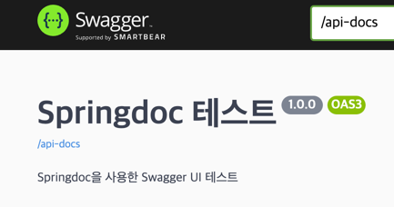

4. Controller 설정

PostController
```
@RestController
@RequiredArgsConstructor
@RequestMapping("/posts")
@Tag(name="Post Controller", description="게시글 컨트롤러")
public class PostController {
    private final PostService postService;
    private final PostImageService postImageService;

    // 게시글 생성
    @PostMapping(value="/{userId}", consumes = MediaType.MULTIPART_FORM_DATA_VALUE)   //로그인 구현 후 수정   //Swagger에서 MultipartFile을 받게 하기 위해
    @Operation(summary="게시글 생성", description="새 게시글 생성")
    @ApiResponses(value={
            @ApiResponse(responseCode="201", description="게시글 생성 성공"),
            @ApiResponse(responseCode="400", description="게시글 생성 실패")
    })
    @Parameters({
            @Parameter(name = "userId",description = "게시글 생성할 유저의 id", in = ParameterIn.PATH ,required = true),
    })
    public ResponseEntity<Void> createPost(@ModelAttribute PostRequestDto postRequestDto, @PathVariable Long userId){
        postService.createPost(postRequestDto, userId);
        return ResponseEntity.status(HttpStatus.CREATED).build();
    }

    // 특정 유저의 전체 게시글 조회
    @GetMapping("/users/{userId}")    //로그인 구현 후 수정
    @Operation(summary="유저의 게시글 조회", description="특정 유저의 전체 게시글 조회")
    @ApiResponses(value={
            @ApiResponse(responseCode="200", description="게시글 조회 성공"),
            @ApiResponse(responseCode="404", description="해당 id 유저 존재하지 않음")
    })
    @Parameters({
            @Parameter(name = "userId",description = "게시글 조회할 유저의 id", in = ParameterIn.PATH ,required = true),
    })
    public ResponseEntity<List<PostResponseDto>> getAllPostsByUser(@PathVariable Long userId){
        List<PostResponseDto> dtos=postService.getAllPostsByUser(userId);
        return ResponseEntity.ok().body(dtos);
    }

    // 하나의 특정 게시글 조회
    @GetMapping("/{postId}")
    @Operation(summary="특정 게시글 조회", description="특정 id의 게시글 조회")
    @ApiResponses(value={
            @ApiResponse(responseCode="200", description="게시글 조회 성공"),
            @ApiResponse(responseCode="404", description="해당 id의 게시글이 존재하지 않음")
    })
    @Parameters({
            @Parameter(name = "postId",description = "조회할 게시글의 id", in = ParameterIn.PATH ,required = true),
    })
    public ResponseEntity<PostResponseDto> getOnePost(@PathVariable Long postId){
        PostResponseDto dto=postService.getOnePost(postId);
        return ResponseEntity.ok().body(dto);
    }
    
    // 팔로잉 중인 유저들의 게시글 전체 조회
    @GetMapping("/{userId}/followings")   //로그인 구현 후 수정
    @Operation(summary="팔로잉 게시글 조회", description="현재 팔로잉하는 사람들의 전체 게시글 조회")
    @ApiResponses(value={
            @ApiResponse(responseCode="200", description="게시글 조회 성공"),
            @ApiResponse(responseCode="404", description="해당 id 유저 존재하지 않음")
    })
    @Parameters({
            @Parameter(name = "userId",description = "현재 조회하려는 유저의 id", in = ParameterIn.PATH ,required = true),
    })
    public ResponseEntity<List<PostResponseDto>> getAllPostsByFollowing(@PathVariable Long userId){
        List<PostResponseDto> dtos=postService.getAllPostsByFollowing(userId);
        return ResponseEntity.ok().body(dtos);
    }

    // 특정 게시글 수정
    @PutMapping(value="/{postId}/{userId}", consumes = MediaType.MULTIPART_FORM_DATA_VALUE)   //로그인 구현 후 수정
    @Operation(summary="게시글 수정", description="특정 게시글 수정")
    @ApiResponses(value={
            @ApiResponse(responseCode="200", description="게시글 수정 성공"),
            @ApiResponse(responseCode="404", description="해당 id 유저/게시글이 존재하지 않음")
    })
    @Parameters({
            @Parameter(name = "userId",description = "유저 id", in = ParameterIn.PATH ,required = true),
            @Parameter(name = "postId",description = "게시글 id", in = ParameterIn.PATH ,required = true),
    })
    public ResponseEntity<PostResponseDto> updatePost(@PathVariable Long postId, @PathVariable Long userId, @ModelAttribute PostRequestDto postRequestDto){
        PostResponseDto dto=postService.updatePost(postId, userId, postRequestDto);
        return ResponseEntity.ok().body(dto);
    }

    //특정 게시글 삭제
    @DeleteMapping("/{postId}")
    @Operation(summary="게시글 삭제", description="특정 id의 게시글 삭제")
    @ApiResponses(value={
            @ApiResponse(responseCode="200", description="게시글 삭제 성공"),
            @ApiResponse(responseCode="404", description="해당 id의 게시글이 존재하지 않음")
    })
    @Parameters({
            @Parameter(name = "postId",description = "삭제할 게시글의 id", in = ParameterIn.PATH ,required = true),
    })
    public ResponseEntity<Void> deletePost(@PathVariable Long postId){
        postService.deletePost(postId);
        return ResponseEntity.ok().build();
    }

}
```
- `@Tag`
  
  API를 그룹화 할 태그명 지정

- `@Operation`

  API에 대한 설명을 작성

- `@ApiResponse`

  응답 코드에 대한 정보를 나타낸다

- `@Parameters`

  입력받는 파라미터에 대한 정보를 나타낸다

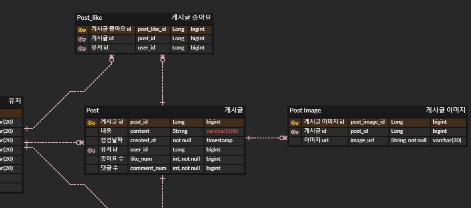
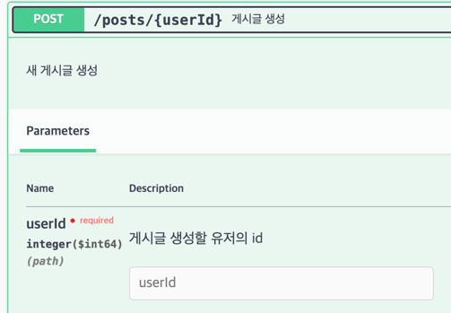
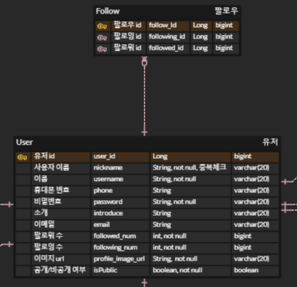

성공하면 아래와 같은 응답이 뜬다.
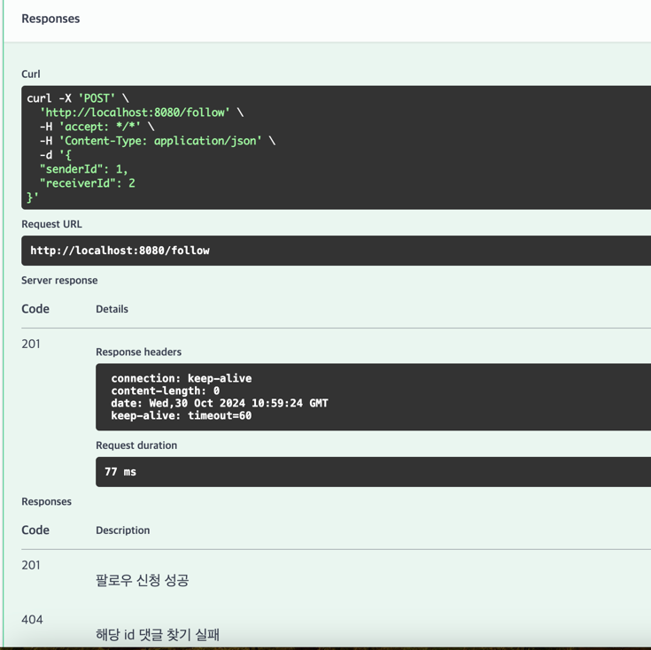


# 5주차
## 📍지난주차 리팩토링
### < equals, hashcode를 이용한 동등성 비교 >
게시글 수정과정에서, 삭제되어야 할 이미지리스트를 받아 기존 이미지 리스트에서 해당 이미지들을 제거해주는 방식으로 이미지 수정을 구현했었다.
```java
    public void update(PostRequestDto postRequestDto,List<PostImage> newImages, List<PostImage> deletedImages) {
        this.content=postRequestDto.getContent();
        this.images.removeAll(deletedImages);
        this.images.addAll(newImages);
    }
```
그런데 이미지 삭제와 관련해서 아래와 같은 리뷰를 받았다. 
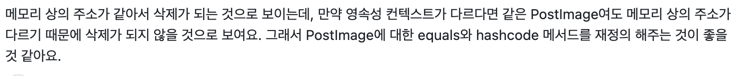

removeAll 메소드는 PostImage 객체의 동등성을 기준으로 삭제할 항목을 결정하게 된다. 자바에서는 기본적으로 `메모리 주소`로 동등성을 비교하기 때문에 removeAll이 동작하기 위해서는 같은 메모리 주소를 참조하는 객체여야 한다고 한다. 그런데 JPA에서는 영속성 컨텍스트가 다르다면 동일한 데이터베이스 엔티티라도 메모리 주소가 달라 서로 다른 객체로 인식되어 removeAll에서 삭제되지 않을 수 있다고 한다.

cf) 영속성 컨텍스트가 달라지는 경우
 1. 트랜잭션 범위가 다를 때 (@Transactional) : 서로 다른 트랜잭션에서 동일한 엔티티를 조회하면 새로운 영속성 컨텍스트가 생성되어 이전 트랜잭션에서 가져온 동일한 엔티티와 다른 인스턴스가 되어버린다.
2. 지연로딩 방식으로 동일한 엔티티 조회할 때 : 지연로딩을 이용해 동일한 엔티티 조회할 때 JPA는 엔티티를 프록시 객체로 생성하고 이 엔티티에 접근하는 순간 프록시를 초기화 한다. 초기화가 아직 되지 않은 상태라면 따라 동일한 엔티티가 서로 다른 객체로 취급될 수 있어 초기화 여부에 따라 동일 객체 여부가 달라진다.

따라서 equals 메소드와 hashCode 메소드 모두 오버라이딩을 통해 재정의 해주어야 한다!


```
@Entity
public class PostImage {
    @Id
    @GeneratedValue(strategy = GenerationType.IDENTITY)
    @Column(name="post_image_id")
    private Long id;

    private String postImageurl;
    private String originalFileName;

    //하나의 게시글 내에서 이미지 순서를 나타냄(사용자가 지정)
    private int imageOrder;

    @ManyToOne(fetch = FetchType.LAZY)
    @JoinColumn(name="post_id")
    private Post post;


    @Override
    public boolean equals(Object o) {
        if (this == o) return true;
        if (o == null || getClass() != o.getClass()) return false;
        PostImage postImage = (PostImage) o;
        return Objects.equals(id, postImage.id);
    }

    @Override
    public int hashCode() {
        return Objects.hash(id);
    }

}

```
- `equals` : 기본적으로 equals는 객체의 메모리 주소를 기준으로 비교하므로 두 객체의 메모리 주소가 같을 때만 true를 반환한다. 메모리 주소 값이 아니라 객체의 특정 필드값(id)을 기준으로 비교하고 싶으면 equals 메서드를 오버라이딩 해주면 된다. equals 메서드를 오버라이드하여 id 필드로 비교하게 하면, 영속성 컨텍스트가 달라져도 id 값이 동일하면 같은 객체로 인식하게 되어 위의 List.remove 삭제 기능이 잘 작동하게 된다.
- `hashCode` : 기본적으로 객체의 메모리 주소 값을 해싱하여 해시코드를 만든 후 반환한다. 따라서 서로 다른 두 객체는 같은 해시코드를 가질 수 없게 된다. equals()의 결과가 true인 두 객체의 해시코드는 반드시 같아야 하기 때문에 *equals를 오버라이드 할 때 hashCode도 함께 재정의 해주어야 한다*. `return Objects.hash(id)` : id 필드를 기준으로 해시코드를 생성하고 반환하게 되어 id 값이 동일한 객체는 동일한 해시코드를 가지게 된다.


## 📍회원가입
비밀번호가 유출될 경우 해커가 사용하게 되는 경우를 방지하기 위해 비밀번호를 암호화해서 데이터베이스에 저장해야한다.
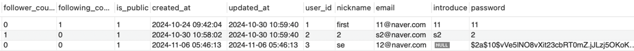

## 📍인증방식
### 1) 세션 + 쿠키를 이용한 인증
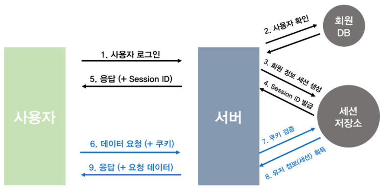
사용자가 로그인을 시도하면 서버에서 사용자 정보를 읽어 사용자 확인 한 후 세션 저장소에 사용자에게 고유한 Session ID를 생성하여 저장한다. 
서버는 로그인에 대한 응답으로 Response Header에 발급된 Session ID를 실어 보낸다. 사용자는 이 Session ID를 쿠키에 저장하고, 이후 매 요청마다 Http Request Header에 이 쿠키를 실어보내고,
서버에서는 이 쿠키를 받아 세션 저장소에서 대조를 한 후, 대응되는 정보가 있다면 인증이 완료된 것이므로 사용자에게 맞는 데이터를 보내준다..

단점 : 서버에 세션 저장소를 두고 여기에 Session ID를 저장해야 하기 때문에 추가적인 저장공간을 필요로 한다. 또한 요청이 들어올 때마다 db에서 조회해야 하므로 속도가 느리고 접속자가 많으면 성능이 저하될 수가 있다. + 쿠키 탈취 위험

### 2) Access Token + Refresh Token을 이용한 인증
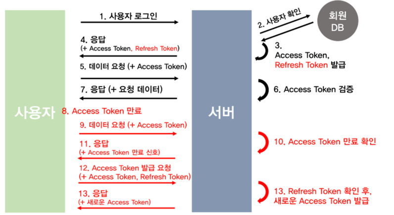
1)클라이언트가 요청을 보내면 서버측에서는 요청 헤더에 access라는 이름의 헤더값을 읽는다.

2-1) 이때 access 토큰이 없다면 → 이 필터는 더 이상 처리하지 않고 요청을 다음 필터로 넘긴다. 인증이 필요없는 경로의 요청이라면 permitAll()과 같은 설정에 의해 인증 없이 정상적으로 처리한다.(ex. /login 요청 : LoginFilter에서 가로채서 로그인 로직을 수행) 인증이 필요한 경로의 요청이라면 Spring Security의 다른 필터가 요청이 인증되지 않은 상태임을 인식하고 401 Unauthorized 응답을 반환한다.

2-2) access 토큰이 존재한다면 → 만료되지 않았는지, 토큰 타입이 access가 맞는지 검증을 하게 된다.

3-1) 만료되지 않고 토큰 타입도 올바르다면 → 클라이언트의 요청을 처리해 응답해준다.

3-2) 만료되었다면 → access 토큰이 만료되었다고 클라이언트에게 응답을 보내게 되고, 그럼 클라이언트는 refresh 토큰과 access 토큰을 요청 헤더에 실어 토큰 재발급 요청을 하게 된다.
서버는 받은 HTTP 요청 헤더의 Refresh 토큰과 사용자의 DB에 저장되어 있던 Refresh 토큰을 비교하여 토큰이 동일하고 유효기간이 만료되지 않았는지 확인한다. 모든 조건을 만족한다면 Refresh 토큰으로부터 user 정보를 가져와 새로운 access 토큰을 발급해주며 Refresh Rotate를 위해 새로운 refresh 토큰도 함께 발급해주고 기존의 refresh 토큰은 db에서 삭제해버린다.

3-3) 토큰 타입이 access가 아니라면 → 401 응답을 보내게 된다.


## 📍로그인 및 인증 과정
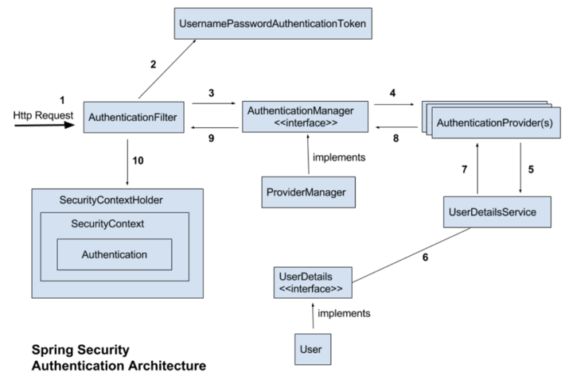


## 📍스프링 시큐리티의 인증 과정

1. 인증에 필요한 사용자 정보를 받아 "준비"하는 단계

- 사용자가 로그인 요청시 보낸 아이디, 비밀번호를 담은 Authentication(UsernamePasswordAuthenticationToken) 생성하고 AuthenticationManager에게 보낸다.

2. 준비단계에서 만들어진 Authentication (UsernamePasswordAuthenticationToken)를 기반으로 "인증을 진행"

- AuthenticationManager가 Authentication 객체에 담긴 아이디와 패스워드를 db에 저장된 정보와 일치하는지 확인

3. 인증 "완료"

- 인증이 성공적으로 완료되면, 인증된 사용자의 정보가 포함된 Authentication(UsernamePasswordAuthenticationToken) 객체를 생성하고, 이 Authentication을 SecurityContext에 저장한다. 이후 애플리케이션에서 SecurityContextHolder를 통해 인증된 사용자의 정보를 참조할 수 있다.
- 인증 실패시 401 Aunautorized 상태를 응답하게 된다.

## 📍SecurityContextHolder, SecurityContext, Authentication
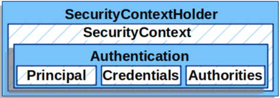

- SecurityContextHolder → 인증된 사용자의 상세 정보를 보관해주는 장소
- SecurityContext → SecurityContextHolder를 통해 얻을 수 있으며, 현재 인증된 사용자의 정보(Authentication)를 포함한다
- Authentication → principal, credentials, authorities 필드를 가지며, 인증 전 상황과 인증 후 상황에 따라 사용되는 목적이 달라진다. 

SecurityContextHolder는 로그인한 사용자의 username, user id, role 등의 정보를 저장하고 이를 필요할 때 추출할 수 있는 저장소 역할을 한다. JWTFilter는 요청에 포함된 JWT를 검증하고나서 유효한 경우에 UsernamePasswordAuthenticationToken 객체를 생성해 SecurityContextHolder에 보관한다. 이 UsernamePasswordAuthenticationToken에는 사용자의 UserDetails 객체가 담겨 있는데, 이 객체에 담는 정보를(아래 코드에서는 username, role, id) 추출할 수 있다. UserDetails 객체에 담길 정보는 JWT에서 추출된 것이므로 JWT에도 해당 정보를 포함해야 한다.

cf) 로그인 한 사용자의 정보 이용할 때 @AuthenticationPrincipal을 이용할 수 있는데 이는 SecurityContextHolder에서 principal (UserDetails)을 가져오게 되는 것이다.
```
String username=jwtUtil.getUsername(token);
        String roleStr=jwtUtil.getRole(token);
        UserRole roleEnum = UserRole.valueOf(roleStr); // 문자열을 Role enum으로 변환
        Long userId=jwtUtil.getUserId(token);

        User user= User.builder()
                .username(username)
                .role(roleEnum)
                .id(userId)
                .build();


        //UserDetails에 유저 정보 객체 담기
        CustomUserDetails customUserDetails=new CustomUserDetails(user);

        //인증 성공 후 만든 Authentication(UsernamePasswordAuthenticationToken) -> 따라서 비밀번호는 삭제해야 하므로 null로 Authentication 객체 생성
        Authentication authToken=new UsernamePasswordAuthenticationToken(customUserDetails, null, customUserDetails.getAuthorities());

        //세션에 사용자 저장
        SecurityContextHolder.getContext().setAuthentication(authToken);
```

## 📍Authentication

Authentication은 인터페이스이며 id,password를 통한 인증인 경우엔 Authentication가 `UsernamePasswordAuthenticationToken` 구현체로 표현된다.

위에서 설명했던 `준비단계에서 만들어진 UsernamePasswordAuthenticationToken`과 `인증 완료 후 만들어진 UsernamePasswordAuthenticationToken`은 **서로 다른 객체**이다!!
- 인증 전 : 인증을 요구하는 주체가 인증에 필요한 정보(로그인 아이디, 패스워드)를 제공하기 위해 사용
  - principal - 로그인 시도 아이디(String)
  - credentials - 로그인 시도 비밀번호(String)
  - 인증 여부 - false
- 인증 후 - 인증이 완료된 사용자의 정보를 저장하는데 사용
  - principal - 인증이 완료된 사용자 객체(UserDetails의 구현체)
  - credentials - 인증 완료후 유출 가능성을 줄이기 위해 삭제
  - authorities - 인증된 사용자가 가지는 권한 목록
  - 인증 여부 - true
  
```
public abstract class AbstractAuthenticationToken implements Authentication, CredentialsContainer {
}
 
public class UsernamePasswordAuthenticationToken extends AbstractAuthenticationToken {
 
	private static final long serialVersionUID = SpringSecurityCoreVersion.SERIAL_VERSION_UID;
 
	private final Object principal;
 
	private Object credentials;
 
	// 인증 완료 전의 객체 생성
	public UsernamePasswordAuthenticationToken(Object principal, Object credentials) {
		super(null);
		this.principal = principal;
		this.credentials = credentials;
		setAuthenticated(false);
	}
 
	// 인증 완료 후의 객체 생성
	public UsernamePasswordAuthenticationToken(Object principal, Object credentials,
			Collection<? extends GrantedAuthority> authorities) {
		super(authorities);
		this.principal = principal;
		this.credentials = credentials;
		super.setAuthenticated(true); // must use super, as we override
	}
```

### 📍로그인 및 API 테스트
로그인 결과 response header에 access 토큰이, cookie에 refresh 토큰이 잘 담겼음을 확인할 수 있다.
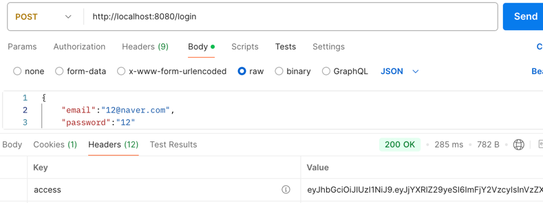
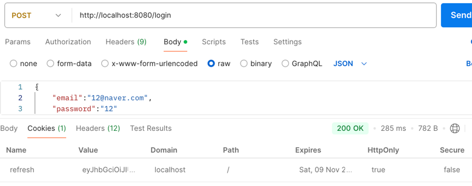

reqeust header에 access 토큰을 실어서 요청을 보내면 인증이 필요한 경로의 요청이 잘 수행된다.
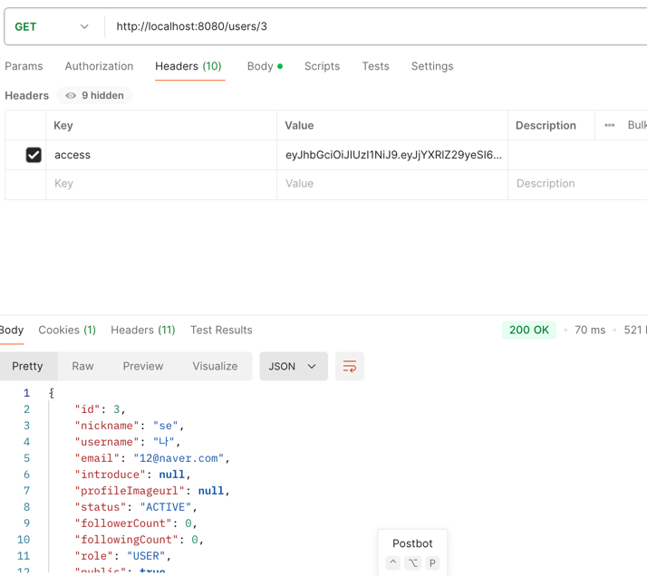


### 📍RefreshRotate
Refresh 토큰을 받아 새로운 access 토큰을 발급해줄 때 refresh 토큰도 함께 갱신해주는 방법이다. Access 토큰은 통신과정에서 탈취당할 위험이 커서 만료기간을 짧게 두고 주기가 긴 Refresh 토큰으로 주기적으로 재발급 받도록 한다. 하지만 Refresh 토큰도 탈취당할 수 있기 때문에 이를 방지하고 로그인 지속시간이 길어진다는 장점(refresh 토큰이 계속 갱신돼서)이 있어 Refresh Rotate를 실행한다.

#### 서버측 주도권
단순히 JWT를 발급하여 클라이언트 측으로 전송하면 인증/인가에 대한 주도권 자체가 클라이언트 측에 맡겨진다. 이 경우 JWT가 탈취되면 만료되기 전까지 서버는 이를 막을 수 없다. 이를 방지하기 위해, 생명주기가 긴 refresh 토큰은 발급 시 서버 측 저장소에 저장해야 한다! 이후 클라이언트가 refresh 토큰을 사용해 요청을 보낼 때, 서버는 해당 토큰이 저장소에 있는지 확인하여 저장소에 저장된 토큰만 허용함으로써 "서버가 주도권"을 가질 수 있도록 한다.
Refresh토큰이 계속 쌓일 경우 용량 문제가 발생할 수 있다. 이를 방지하기 위해 RDB를 사용하는 경우엔 스케줄러를 실행하여 일정 주기마다 유효기간이 지난 refresh 토큰을 삭제해주고, Redis를 사용하는 경우 TTL 설정을 통해 유효기간이 지나면 자동으로 삭제되게끔 하는 게 좋다.