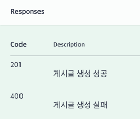
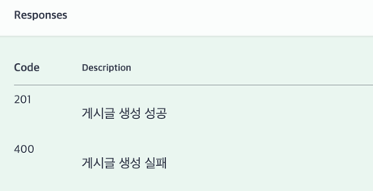

# spring-instagram-20th
CEOS 20th BE study - instagram clone coding

## ERD

### 전체 구조


### 세부 구조

#### 1. 유저 간 1:1 DM 기능



   - 처음에는 한 명의 유저는 여러 dm방을 가질 수 있고, 하나의 dm방은 여러 유저와 관계를 맺을 수 있기에 다대다 관계이므로 1:N, N:1 관계로 풀어주기 위해 중간테이블을 두려고 했다. 하지만 이 방식에서는 Message 테이블이 User와 Room을 직접 참조하지 못하고 Dm_Member를 거쳐야 해 구조가 복잡해져 다시 생각해보았다. 1:1 채팅이기에 하나의 채팅방은 두명의 유저와만 관계를 맺기 때문에 굳이 다대다 관계로 볼 필요가 없이, DmRoom 엔티티에 유저1 id와 유저2 id를 외래키로 두어 각 유저와 Dm방이 관계를 맺도록 함으로써 DM방과 User를 N:1관계로 보았다. 대신 이 관계를 두 유저와 가지므로 두 번 가지게 된다.

   - 각 메시지마다 담아야 하는 정보가 많기 때문에 메시지를 채팅방 엔티티에 포함시키지 않고 Message 엔티티로 따로 분리하고 User와 DmRoom 엔티티와 관계를 맺도록 했다.


#### 2. 게시글 기능


   - 게시글 이미지 : 사진을 포함한 게시글을 작성할 수 있도록 이미지 엔티티를 생성하였으며, 게시글 ID를 외래 키로 설정하여 각 게시글에 사진을 첨부할 수 있도록 구성하였다. 서버에 이미지를 업로드한 후 해당 이미지의 URL을 데이터베이스에 저장하도록 하였다.
   
   - 좋아요 및 댓글 수 : 좋아요 수와 댓글 수를 저장한다.

   - 게시글 좋아요 : 한 명의 유저는 여러 게시글에 좋아요를 누를 수 있고, 한 게시글은 여러 유저로부터 좋아요를 받을 수 있어 다대다 관계다. 따라서 중간테이블인 게시글 좋아요 테이블을 두고 유저 id와 게시글 id을 외래키로 가져 관계를 맺도록 했다.


#### 3. 댓글 기능


   - 대댓글 : 댓글과 대댓글은 1:N 관계이고 이를 구현하기 위해서 Comment 엔티티에 부모댓글 id인 parent_id를 외래키로 설정하고 이를 참조하도록 했다. 해당 댓글이 부모댓글이라면 parent_id는 null이므로 parent_id 필드는 null을 허용해준다.

   - 댓글 좋아요 : 댓글 좋아요 엔티티를 두고 유저 id와 게시글 id을 외래키로 가져 관계를 맺도록 했다.

#### 4. 유저 기능



   - 회원가입 : 휴대폰 번호 or 이메일, 성명, 사용자 이름(닉네임), 비밀번호를 입력해 회원가입 한다. 이때 사용자 이름은 중복되지 않게 검사해주어야 한다.
   
   - 로그인 : 휴대폰 번호 or 이메일 or 사용자 이름과 비밀번호를 입력해 로그인한다.

   - 프로필 이미지 : 사용자는 하나의 프로필 사진만 설정할 수 있고, 별도로 관리할 이미지 속성이 없기 때문에 이미지 엔티티를 따로 생성하지 않고, User 엔티티에 이미지 URL을 저장하도록 했다.

   - 팔로우 기능 : 유저 간에는 팔로잉과 팔로워 관계가 존재한다. 한 유저는 여러 유저를 팔로우 할 수 있고, 한 유저는 여러 유저로부터 팔로우를 받을 수 있다. 따라서 Follow 테이블에 팔로우하는 유저의 ID와 팔로우받는 유저의 ID를 각각 외래 키로 저장하였다.
   

## 엔티티 생성
Test에 쓰일 Post 엔티티는 다음과 같다.
```
@Entity
@Getter
@NoArgsConstructor(access = AccessLevel.PROTECTED)
@Builder
@AllArgsConstructor // Builder는 파라미터 있는 생성자가 필요
public class Post {
    @Id
    @GeneratedValue(strategy = GenerationType.IDENTITY)
    @Column(name="post_id")
    private Long id;

    private String content;
    private int like_num;
    private int comment_num;

    @CreationTimestamp
    @Column(updatable=false)
    private LocalDateTime created_at;

    @ManyToOne(fetch = FetchType.LAZY)
    @JoinColumn(name="user_id")
    private User user;

    @OneToMany(mappedBy="post")
    private List<PostImage> images;

    @OneToMany(mappedBy="post")
    private List<PostLike> likes;

}

```
JPA의 Entity는 기본 생성자(NoArgsConstructor)가 반드시 필요하다!

-> 이유 : JPA는 데이터베이스에서 조회한 값을 엔티티 객체로 변환할 때 **Reflection**을 사용하여 객체를 생성한다. 이 과정에서 기본 생성자를 호출해 빈 객체를 먼저 만든 후, 조회한 데이터를 각 필드에 매핑한다. 따라서 기본 생성자가 없다면  JPA는 객체를 생성할 수 없고, 결국 데이터베이스에서 조회한 값을 엔티티로 변환하는 작업이 실패하게 된다.
Reflection이란? : 리플렉션은 자바에서 제공하는 기능으로, 구체적인 Class Type을 알지 못해도 런타임에 해당 클래스의 이름, 변수, 메소드에 접근할 수 있게 해준다.


## Repository 단위 테스트
Post Repository에서 user_id로 Post를 찾아 조회하는 단위테스트를 진행했다. Repository 단위테스트에는 @JpaDataTest를 많이 사용한다고 한다.
```
@DataJpaTest
@AutoConfigureTestDatabase(replace = AutoConfigureTestDatabase.Replace.NONE)
@Import({PostRepository.class,UserRepository.class})
class PostRepositoryTest {

    @Autowired
    private PostRepository postRepository;

    @Autowired
    private UserRepository userRepository;

    private Post post1;
    private Post post2;
    private Post post3;
    private User user;

    @BeforeEach // 테스트 실행 전에 실행
    void setUp(){
        user=User.builder()
                .nickname("sh")
                .username("test1")
                .phone("010-1111-1111")
                .email("11@naver.com")
                .password("111")
                .introduce("test")
                .followed_num(0)
                .following_num(1)
                .profile_image_url("https://example.com/default-profile.png")
                .isPublic(true)
                .build();

        post1=Post.builder()
                .content("testPost 1")
                .like_num(0)
                .comment_num(0)
                .user(user)
                .build();

        post2=Post.builder()
                .content("testPost 2")
                .like_num(1)
                .comment_num(0)
                .user(user)
                .build();

        post3=Post.builder()
                .content("testPost 3")
                .like_num(0)
                .comment_num(2)
                .user(user)
                .build();

        userRepository.save(user);
        postRepository.save(post1);
        postRepository.save(post2);
        postRepository.save(post3);
    }

    @Test
    @Transactional
    void 게시글_조회_테스트(){

        //given
        Long userId=user.getId();

        //when
        List<Post> posts=postRepository.findByUser_Id(userId);

        //then
        // 게시글 갯수 확인
        assertEquals(3, posts.size());
        // 게시글 내용 확인
        assertEquals("testPost 1", posts.get(0).getContent());
        assertEquals("testPost 2", posts.get(1).getContent());
        assertEquals("testPost 3", posts.get(2).getContent());

    }
}

```

- 과정 : @BeforeEach를 사용하여 테스트 전에 user,post 객체를 생성하여 repository에 저장하게끔 했다. 이후, user 객체에서 user_id를 가져와 이 user_id를 사용하여 해당 사용자의 post를 조회하는 테스트를 수행

cf) 처음에는 `@Import({PostRepository.class,UserRepository.class})` 를 빼고 테스트 진행했더니 `No qualifying bean of type 'com.ceos20.instagram.post.repository.PostRepository' available` 오류가 발생했다..

이는 내가 구현한 PostRepository가 JpaRepository를 상속한 인터페이스가 아니라 직접 구현된 클래스이기 때문이다. Spring은 JpaRepository를 상속하는 인터페이스를 자동으로 빈으로 등록하지만, 그렇지 않은 직접 구현한 리포지토리는 자동으로 빈을 생성하지 않으므로 이를 수동으로 등록해야한다. 따라서 **@Import(PostRepository.class)** 를 통해 해당 리포지토리를 테스트에 수동으로 주입해야 한다.


테스트 성공 후 아래와 같은 쿼리가 출력된다.

1. @BeforeEach 를 통해 user와 post1,2,3 객체를 생성 후 테이블에 저장
```
Hibernate: 
    insert 
    into
        user
        (email, followed_num, following_num, introduce, is_public, nickname, password, phone, profile_image_url, username) 
    values
        (?, ?, ?, ?, ?, ?, ?, ?, ?, ?)
Hibernate: 
    insert 
    into
        post
        (comment_num, content, created_at, like_num, user_id) 
    values
        (?, ?, ?, ?, ?)
Hibernate: 
    insert 
    into
        post
        (comment_num, content, created_at, like_num, user_id) 
    values
        (?, ?, ?, ?, ?)
Hibernate: 
    insert 
    into
        post
        (comment_num, content, created_at, like_num, user_id) 
    values
        (?, ?, ?, ?, ?)
```

2. findByUser_Id의 파라미터로 전달받은 user_id와 같은 user_id를 가진 post를 post 테이블에서 찾는다.

```
Hibernate: 
    select
        p1_0.post_id,
        p1_0.comment_num,
        p1_0.content,
        p1_0.created_at,
        p1_0.like_num,
        p1_0.user_id 
    from
        post p1_0 
    where
        p1_0.user_id=?
```